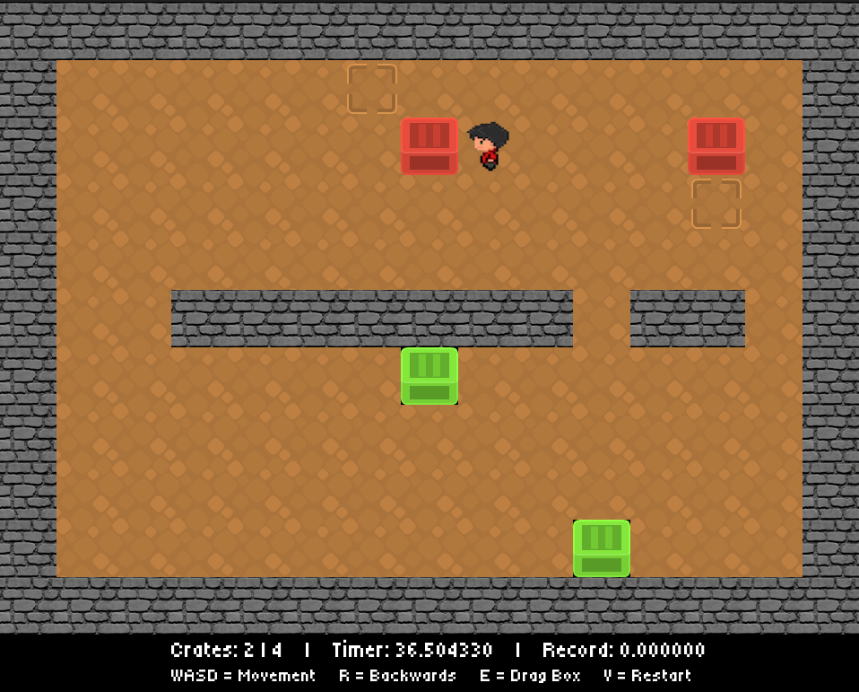
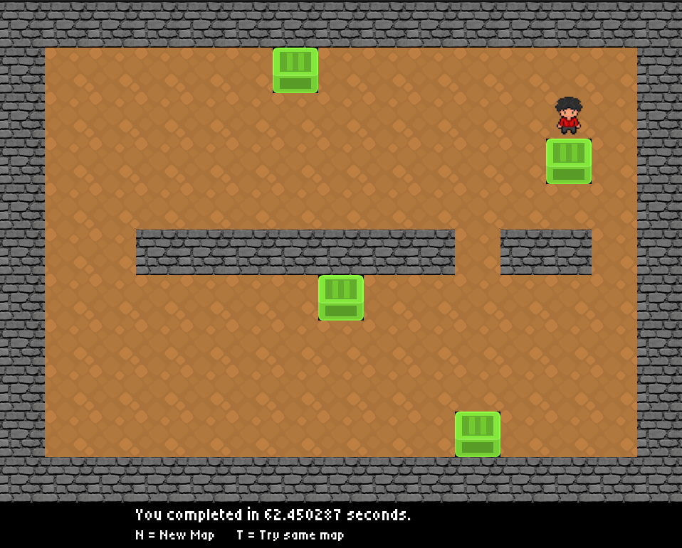
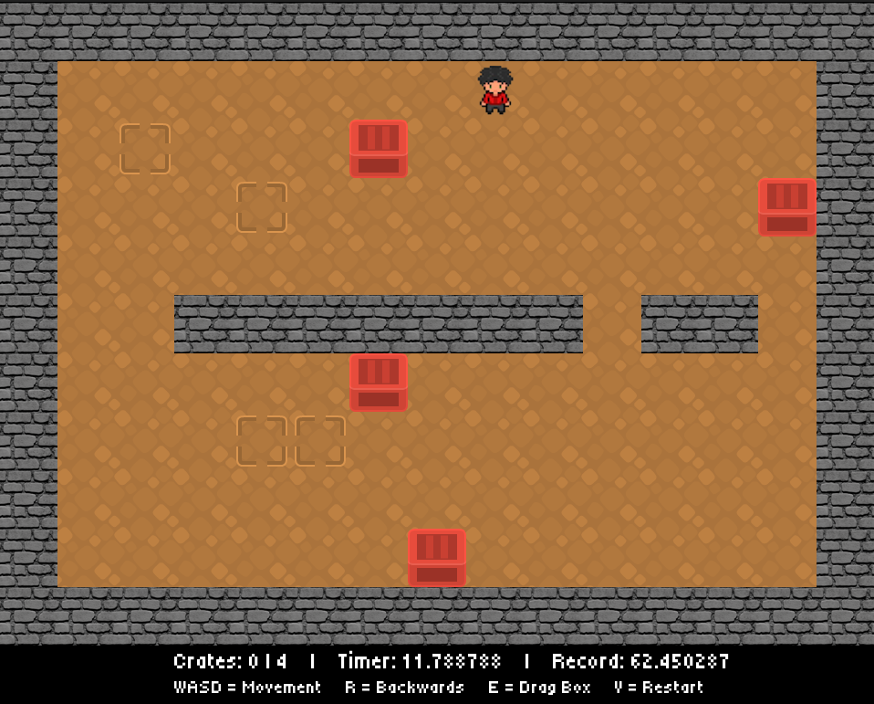

# Sokoban - Brendon So

# Intro
Hello! This is my project which is a Sokoban puzzle game, where the players goal is to push the boxes in the correct location. It was developed in Linux with the SFML libary in C++. The game is able to store data and generate new maps and includes algorithms that help gameplay mechanics such as backtracking steps and dragging back crates.

**Initial map layout with some crates in position.**


**Completed game**


**A new generated object locations**



# Features
- **Gameplay Tracking**: Saves every movement in the game and allows the player to backtrack each step with the 'R' key, and drag boxes with the 'E' key.
- **Map Generation**: Generates new layouts for objects locations and ability to reset the map. 

# Installation
**Clone or download**
```bash
git clone https://github.com/brendonso/Sokoban.git
```
**To run this game, it requires you to install the SFML library.** 
```bash
sudo apt-get install libsfml-dev
```
**Compile in the projects folder**
```bash
make
```
**Run**
```bash
./Sokoban
```